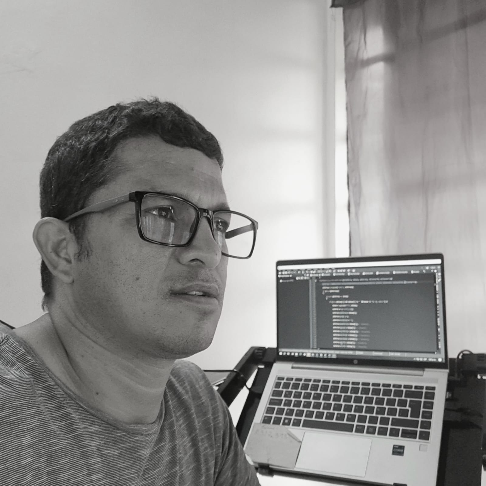

### Hi there 👋

<!--header-->
<a href="https://www.linkedin.com/in/fabricio-galarza-7bb174b9/" style="text-align:center; text-decoration:none"><h1> I'm Fabricio</h1></a>

<h2>My Skills</h2>
<h2>Frontend</h2>
<ul>
<li>
HTML5
</li>
<li>
CSS
</li>
<li>
Bootstrap
</li>
</ul>
<h2>Languages</h2>
<ul>
<li>
PHP
</li>
<li>
Python
</li>
<li>
C#
</li>
<li>
PLSQL
</li>
</ul>
<h2>Databases</h2>
<ul>
<li>
Oracle
</li>
<li>
MySQL
</li>
<li>
SQL Server
</li>
<li>
MongDb
</li>
</ul>
<h2>Frameworks</h2>
<ul>
<li>
Laravel
</li>
<li>
Django
</ul>
<h2>Follow me</h2>

